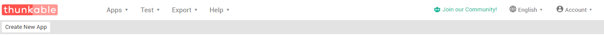
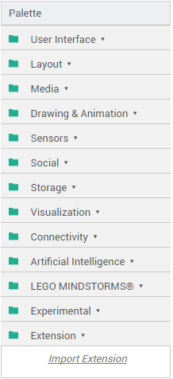
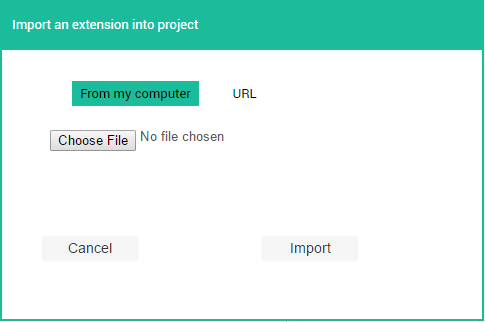
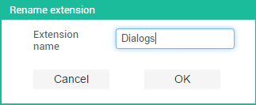
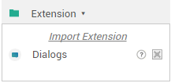
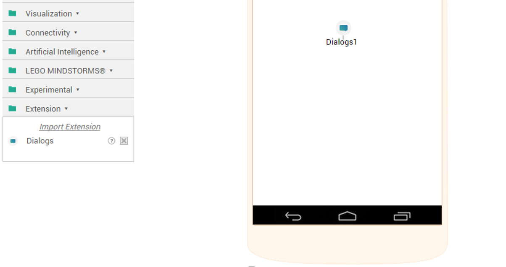
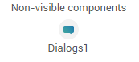
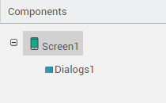

## What are Extensions

Thunkable is limited in the number of components it has to offer and users may want to use components in their apps which Thunkable doesn't provide. This is the reason extension components were introduced - so that users can create their own components and use them in their apps. Extensions **currently** only allow non-visible components to be added to apps which means functions that work without the user being able to see it on the screen will work.

### List of Extensions

A list of extensions is maintained over on the <a href="
http://community.thunkable.com/t/index-of-available-extensions/2680?u=barreeeiroo
"> Thunkable Community</a>

## How to Install an Extension

#### Step 1
Navigate to <a href="http://app.thunkable.com">app.thunkable.com</a> and login using your Google Account.
 
You should now see a screen with this at the top:

#### Step 2
Open an exising project or create a new one.
 
To create a new project, click the "Create New App" button at the top of the screen, just under the Thunkabe logo.

#### Step 3
Find the extension you want to import into your app. There is a full list of Thunkable extensions on our <a href="">homepage</a>

#### Step 4
Either:
<ul>
<li>Download the extension (.aix file) to your computer</li>
<li>Copy the direct download link to the extension to your clipboard</li>
</ul>

#### Step 5
At the left-hand side of the screen, you will see a palette like this:

 
Select the "Extension" label, you will then see a button that says "<i>Import Extension</i>"

#### Step 6
Click the "<i>Import Extension</i>" button. You will see a pop-up box like this:

#### Step 7
If, in Step 4, you downloaded the extension to your computer, click the "Choose File" button.
 
If you copied the direct link, select the "URL" button in the pop-up and paste the link into the textbox.

#### Step 8
Click the "Import" button

#### Step 9
After clicking the "Import" button, you should see a pop-up asking you to rename the extension.
I recommend you leave the name as it is and click "OK". You can rename it if you wish to, though.
 

#### Step 10
Your extension will now show as a component in the palette.

#### Step 11
To use the component in the app, do what you would do with any normal component. Click and drag the extension into the work area.

#### Step 12
You will now see the extension as a non-visible component in your app.

The extension used in this post was the <a href="http://community.thunkable.com/t/releasing-the-dialogs-extension/2574/">Dialogs Extension</a> by <a href="http://community.thunkable.com/users/helios">Helios</a>.

Post written by:
<a href="http://community.thunkable.com/users/conor/">Conor</a>
 Thunkable Community Moderator