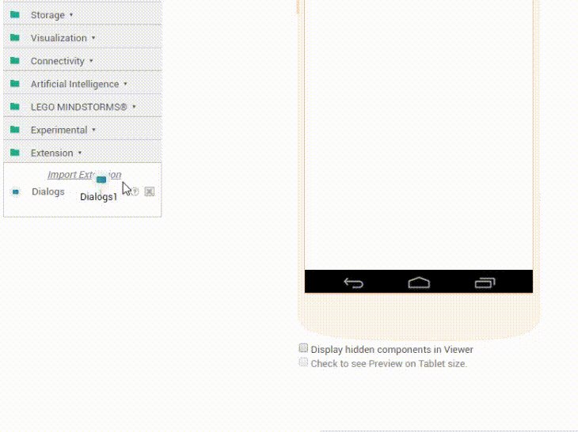

## What are Extensions

Thunkable is limited in the number of components it has to offer and users may want to use components in their apps which Thunkable doesn't provide. This is the reason extension components were introduced - so that users can create their own components and use them in their apps. Extensions **currently** only allow non-visible components to be added to apps which means functions that work without the user being able to see it on the screen will work.

## List of Extensions

A list of extensions is maintained over on the <a href="
http://community.thunkable.com/t/index-of-available-extensions/2680?u=barreeeiroo
"> Thunkable Community</a> but here's a few to give you a flavour of what's available

In our reviews we have used the original extensions and linked directly to the developers download.  
Whenever you use an extension in your app you should make sure that that it comes directly from the developer and has not been modified by a third party.  
The following list is provided for reference only and all extensions are  subject to the licence of the original developer.

### [Thunkable Community Extensions](http://community.thunkable.com/c/thunkable-extensions)

<!-- [NMD Extensions](https://nmd-apps.jimdo.com/extensions/nmd-extensions/) -->
#### Mika's Extensions
- [Simple Mathematics Extension](https://nmd-apps.jimdo.com/extensions/nmd-extensions/#1)
- [Body Mass Index Extension](https://nmd-apps.jimdo.com/extensions/nmd-extensions/#2)
- [QR Code Extension](https://nmd-apps.jimdo.com/extensions/nmd-extensions/#3)
- [Special Tools Extension](https://nmd-apps.jimdo.com/extensions/nmd-extensions/#4)
- [Ocr Extension](https://community.thunkable.com/t/ocr-extension-version-5/9850?u=mika)
- [Image Editor Extension](https://nmd-apps.jimdo.com/extensions/nmd-extensions/#6)
- [Click Listener Extension](https://nmd-apps.jimdo.com/extensions/nmd-extensions/#8)
- [Gesture Handler Extension](https://nmd-apps.jimdo.com/extensions/nmd-extensions/#9)
- [Google URL Shortener/Unshortener Extension](https://community.thunkable.com/t/google-short-extension-test/9886?u=mika)

#### Helios' Extensions
- [Dialogs Extension](http://community.thunkable.com/t/releasing-the-dialogs-extension/2574?u=helios)
- [Colours Extension](http://community.thunkable.com/t/colours-extension/2513?u=helios)
- [Extra Components Extension](https://community.thunkable.com/t/the-extracomponents-extension/4125?u=helios)

#### Pavitra's Extensions
- [Free InAppPurchases Extension](http://community.thunkable.com/t/free-iap-extension/2082?u=pavi2410)
- [Root Checker Extension](http://community.thunkable.com/t/root-checker-extension/1587?u=pavi2410)
- [Arduino USB Serial Extension](https://groups.google.com/d/msg/mitappinventortest/WZCUtKAfwj0/4Na63LmnAQAJ)
- [Phone Info Extension](http://community.thunkable.com/t/phone-info-extension/1600?u=pavi2410)
- [Floating Action Button Extension](http://community.thunkable.com/t/fab-extension-material-ui-feature/3488?u=pavi2410) - _By: Pavi and Sander_

#### Sander's Extensions
<!-- <small>@Sander0542</small> -->

- [BluetoothPlus Extension](https://www.sanderjochems.com/appinventor/extension/1/bluetoothplus)
- [ScreenTools Extension](https://www.sanderjochems.com/appinventor/extension/2/screentools)
- [Vibrate Extension](https://www.sanderjochems.com/appinventor/extension/3/vibrate)
- [Convert Extension](https://www.sanderjochems.com/appinventor/extension/5/convert)
- [Floating Action Button Extension](http://community.thunkable.com/t/fab-extension-material-ui-feature/3488?u=sander0542) - _By: Pavi and Sander_
- [Sound Manager Extension](https://www.sanderjochems.com/appinventor/extension/6/soundmanager)

#### Andres Daniel Cotes' Extensions
- [ActionBar Extension](https://community.thunkable.com/t/actionbar-extension/4985?u=Andres_Cotes)
- [Android Theme Extension](https://community.thunkable.com/t/android-theme-extension/6602?u=Andres_Cotes)
- [Animation Extension](https://community.thunkable.com/t/extension-animacion/5015?u=Andres_Cotes)
- [Animation Color Background Extension](https://community.thunkable.com/t/animation-color-background-extension/5275?u=Andres_Cotes)
- [Button Addon Extension](https://community.thunkable.com/t/button-addon-extension/9790?u=Andres_Cotes)
- [CallLog and WhatsApp Utils Extension](https://community.thunkable.com/t/calllog-and-whatsapp-utils-extension/5741?u=Andres_Cotes)
- [Chat Listview Extension](http://community.appybuilder.com/t/chat-listview-extension-preview/1177?u=Andres_Cotes)
- [Circle Display Extension](https://community.thunkable.com/t/circledisplay-extension-paid-extension/7506?u=Andres_Cotesn)
- [Color Picker Tool Extension](https://community.thunkable.com/t/colorpicker-tool-extension-paid/8280?u=Andres_Cotes)
- [Control Dimmer Extension](https://community.thunkable.com/t/control-dimmer-extension/8560?u=Andres_Cotes)
- [Create Pdf from Table Extension](https://groups.google.com/d/msg/mitappinventortest/KHg0-dptfUg/WGuIR1y2AQAJ)
- [CSV to Json encode Extension](https://groups.google.com/d/msg/mitappinventortest/Dcu3ueYnhl0/dDdyR_38EAAJ)
- [Custom Listview Extension](https://community.thunkable.com/t/extension-customlistview-paid-extension/5535?u=Andres_Cotes)
- [Dendritas Table Extension](https://groups.google.com/d/msg/mitappinventortest/B16XCAmuBJo/3EYzPa0ABAAJ)
- [Display Table in Webviewer Extension](https://groups.google.com/d/msg/mitappinventortest/B16XCAmuBJo/3EYzPa0ABAAJ)
- [Dots View Extension](http://community.appybuilder.com/t/dotsview-extension/1679?u=Andres_Cotes)
- [Encryption 3DES Extension](http://community.appybuilder.com/t/encryption-3des-extension/1512?u=Andres_Cotes)
- [Floating Action Button with Material Icon Extension](https://community.thunkable.com/t/demo-fab-with-material-icon-ttf-paid-extension/4712?u=Andres_Cotes)
- [GMail Utils Extension](https://community.thunkable.com/t/send-a-file-with-activity-starter-or-an-extension/6739/2?u=Andres_Cotes)
- [Gauge Extension](https://groups.google.com/forum/#!category-topic/mitappinventortest/VfEcXlmtwdw)
- [Horizontal Arrangement Addon Extension](http://community.appybuilder.com/t/horizontalarrangementaddons-extension/673?u=Andres_Cotes)
- [IP Address Extension](https://groups.google.com/forum/#!category-topic/mitappinventortest/iRgyTGMR7dE)
- [Joystick Extension](https://community.thunkable.com/t/joystick-extension/5693?u=Andres_Cotes)
- [JSignature Extension](http://community.appybuilder.com/t/extension-jsignature/442?u=Andres_Cotes)
- [Label AddOn Extension](https://community.thunkable.com/t/label-add-on-extension-update-02-09-2017/7234?u=Andres_Cotes)
- [LED View Extension](http://community.appybuilder.com/t/led-view-extension/1869?u=Andres_Cotes)
- [ListViewSwipe Extension](https://community.thunkable.com/t/preview-listview-swipe-to-delete-extension/7410?u=Andres_Cotes)
- [Location Service Util Extension](http://community.appybuilder.com/t/locationserviceutil-extension/1462?u=Andres_Cotes)
- [Memory Size Extension](https://community.thunkable.com/t/memory-size-extension-21-05-2017/3764/)
- [MQTT Extension for Arduino and ESP8266](https://groups.google.com/d/msg/mitappinventortest/PguwKcn5PzY/Kg8BJEPGAQAJ)
- [MQTT TCP/IP Extension](https://community.thunkable.com/t/mqtt-tcp-ip-extension-paid-extension/7168?u=Andres_Cotes)
- [Network Tools Extension](https://groups.google.com/d/msg/mitappinventortest/iRgyTGMR7dE/o6Eszo2bBAAJ)
- [Palette Color Extension](https://community.thunkable.com/t/extension-palettecolor/5668?u=Andres_Cotes)
- [Rating Bar Dialog Extension](https://community.thunkable.com/t/rating-bar-dialog-as-a-thank-you-extension/9730?u=Andres_Cotes)
- [Read Contact Extension](https://community.thunkable.com/t/read-contact-extension-paid-extension/7380?u=Andres_Cotes)
- [Record Audio in mp4 aac format Extension](https://community.thunkable.com/t/recorder-audio-in-mp4-aac-format-extension-paid-extension/7178?u=Andres_Cotes)
- [Search Actionbar Extension](https://community.thunkable.com/t/search-actionbar-extension/4649?u=Andres_Cotes)
- [Sidebar Navigation Extension](https://community.thunkable.com/t/extension-sidebar-navigation/5376?u=Andres_Cotes)
- [Snackbar Extension](https://community.thunkable.com/t/snackbar-extension-update-20-06-2017/4337?u=Andres_Cotes)
- [Soundwave View Extension](https://community.thunkable.com/t/sound-wave-view-extension/9405?u=Andres_Cotes)
- [SQlite Extension](https://community.thunkable.com/t/sqlite-extension-paid/8496?u=Andres_Cotes)
- [SQlite Addon Extension](https://groups.google.com/forum/#!msg/mitappinventortest/ZjkCYz7RQ5U/ZG0jFM80AgAJ)
- [Table Extension](https://community.thunkable.com/t/extension-dendritastable-csvtohtml-list-to-html-list-to-json-datatables-js-14-05-17/3399?u=Andres_Cotes)
- [Tabs Extension api < 21](https://community.thunkable.com/t/tabs-extension-api-21-update-20-10-2017/6843?u=Andres_Cotes)
- [Taps Extension](https://community.thunkable.com/t/taps-extension-api-21/6843?u=Andres_Cotes)
- [Taps Swipe Loopup Whatsapp Extension](http://community.appybuilder.com/t/taps-swipe-look-whatapp-paid-extension/1385?u=Andres_Cotes)
- [Toast with X Y values Extension](https://groups.google.com/d/msg/mitappinventortest/nPOokIDvFOE/jv1oztz8EAAJ)
- [Tool Time Extension](http://community.appybuilder.com/t/tooltime-extension/1460?u=Andres_Cotes)
- [Tool Tip Extension](https://community.thunkable.com/t/tool-tip-extension-paid/8680?u=Andres_Cotes)
- [UDP client Extension](https://community.thunkable.com/t/udp-client-extension/5831?u=Andres_Cotes)
- [UDP server Extension](http://community.appybuilder.com/t/server-udp-extension-paid-extension/735?u=Andres_Cotes)
- [Vertical Scroll Arrangement AddOn Extension](http://andrescotes.cf/verticalscrollarramentaddons/)
- [Web Socket Client Extension](http://community.appybuilder.com/t/websocket-client-extension/1761?u=Andres_Cotes)
- [Wheel View Client Extension](https://community.thunkable.com/t/wheelview-extension/9228?u=Andres_Cotes)
- [Youtube Extension](https://community.thunkable.com/t/youtube-extension/5164?u=Andres_Cotes)
- [Youtube Extension (paid)](https://community.thunkable.com/t/youtube-extension-paid-version/8799?u=Andres_Cotes)

#### [ColinTree Extensions](https://github.com/OpenSourceAIX)
- [System Language Extension](https://github.com/OpenSourceAIX/ColinTreeSysLang)
- [Notifier Extension](https://github.com/OpenSourceAIX/ColinTreeNotifier)
- [Math Extended Extension](https://github.com/OpenSourceAIX/ColinTreeMathExtended)
- [Math Extension](https://github.com/OpenSourceAIX/ColinTreeMath)
- [IMEI Extension](https://github.com/OpenSourceAIX/ColinTreeIMEI)
- [Go Home Extension](https://github.com/OpenSourceAIX/ColinTreeGoHome)
- [First Run Extension](https://github.com/OpenSourceAIX/ColinTreeFirstRun)
- [TinyDB Editable Extension](https://github.com/OpenSourceAIX/TinyDBEditable)
- [Vector Arithmetic Extension](https://github.com/OpenSourceAIX/VectorArithmetic)
- [Scroll Arrangement Handler Extension](https://community.thunkable.com/t/new-extensions-scrollarrangementhandler-by-colintree/6949?u=colintree)
- [Nine Patch Support Extension](https://community.thunkable.com/t/new-extension-release-nine-patch-support-by-colintree/7143?u=colintree)
- [Slideshow/Carousel Extension](https://community.thunkable.com/t/colintreeslideshow-version-2-released-2017-9-24/8039?u=colintree)
- [Asynchronous Image Loader Extension](https://community.thunkable.com/t/asynchronous-image-loader-asyncimageloader-by-colintree/8008?u=colintree)
- [Password Visibility Switching Extension](https://community.thunkable.com/t/password-visibility-switching-passwordboxswitch-by-colintree/8182?u=colintree)
- [Autocomplete Textbox Extension](https://community.thunkable.com/t/add-an-autocompletebox-to-your-textbox-autocompletebox-by-colintree/8262?u=colintree)
- [Swipe Refresh Extension](https://community.thunkable.com/t/swiperefresh-extension-by-colintree/8311?u=colintree)
- [Event Caller Extension](https://community.thunkable.com/t/eventcaller-in-test-by-colintree/8975?u=colintree)

#### LukeGackle's Extensions
- [Countdown Extension](https://community.thunkable.com/t/countdown-extension/3730?u=LukeGackle)
- [Webview Tools Extension](https://thunkableblocks.blogspot.com.au/2017/06/webviewtools-extension-for-app-inventor.html)
- [WebViewCookieTools Extension](https://thunkableblocks.blogspot.com.au/2017/06/webviewcookietools-extension.html)
- [JSON Tools Extension](https://thunkableblocks.blogspot.com.au/2017/07/jsontools-extension.html)

#### ILoveThunkable/Ben/Moliata's Extensions
- [Simple Tools Extension](https://community.thunkable.com/t/simple-tools-extension/3724?=ILoveThunkable)
- [WebViewer Dialog Extension](https://community.thunkable.com/t/releasing-the-web-viewer-dialog-extension/3956?u=ILoveThunkable)
- [Image Cropping Extension](https://community.thunkable.com/t/image-cropping-extension/4953?=ILoveThunkable)
- [Extended WebViewer Extension](https://community.thunkable.com/t/extended-web-viewer-extension/4564/35) - _by: ILoveThunkable and Sivagiri_Visakan_
- [System Alert Window Extension](https://community.thunkable.com/t/paid-systemalertwindow-extension-read-description-for-more-info-about-extension/7106?u=ILoveThunkable)
- [FileChooser Extension](http://community.appybuilder.com/t/filechooser-extension-paid/1147?u=ILoveThunkable)
- [Image Print Extension](https://community.thunkable.com/t/image-print-extension/7678?u=ILoveThunkable)

#### Juan Antonio's Extensions
- [Simple Web Server Extension](https://groups.google.com/d/msg/mitappinventortest/-tn-UY7YJGs/tpivqjkVCgAJ)
- [Delete characters from a text Extension](https://groups.google.com/d/msg/mitappinventortest/qN6fuQPNVUQ/NS8X_F35AQAJ)
- [Get all TinyDB Extension](https://groups.google.com/d/msg/mitappinventortest/7-zmkoNA47E/-iovL7GEBAAJ)
- [Convert interger value to words Extension](https://groups.google.com/d/msg/mitappinventortest/IXXE2LFeA6Q/7B7BnuqaBgAJ)
- [TinyDBX Extension](https://groups.google.com/d/msg/mitappinventortest/7n0CPHIfZSc/BoebXhvYCAAJ)
- [Terminal / Shell Extension](https://groups.google.com/d/msg/mitappinventortest/zzW_HW7WLXQ/nAAxHktJCwAJ)
- [File Explorer Extension](https://community.thunkable.com/t/extension-explorer-files-directories-with-copy-move-delete-makedir/7272/5?u=Juan_Antonio)
- [File to String. String to File. Base64 Extension](https://groups.google.com/d/msg/mitappinventortest/TAkRiwgY1yI/wQBnn6E0CwAJ)
- [Tone Generator Extension](https://community.thunkable.com/t/extension-tonegenerator-beep-frequency-duration/7978?u=Juan_Antonio)

#### Jerin Jacob's Extensions
- [General Tools Extension](https://community.thunkable.com/t/my-first-extension-gtools/5662?u=Jerin_Jacob)
- [PdfTools Extension](https://community.thunkable.com/t/simple-pdftools-extension/6115?u=Jerin_Jacob)
- [One Signal Send Extension](https://community.thunkable.com/t/extension-onesignalsend/8767?u=Jerin_Jacob)

#### Mirxtrem Apps' Extensions
- [Firebase Authentication Extension](https://community.thunkable.com/t/firebase-authentication-v-3-0/8543?u=mirxtrem_apps)
- [Facebook Login Extension](https://community.thunkable.com/t/facebook-login-extension/6462/10?u=mirxtrem_apps)
- [Firebase Storage Extension](http://community.appybuilder.com/t/firebasestorage-extension/1521?u=mirxtrem_apps)

#### Red Panda's Extensions
- [Wolfram Alpha Extension](https://community.thunkable.com/t/extension-for-wolfram-alpha-beta/5081?u=red_panda)
- [18n - Localization Extension](https://community.thunkable.com/t/betatesters-needed-for-i18n-extension/7063?u=red_panda)
- [Distance Tools Extension](https://community.thunkable.com/t/distance-tools-extension/7175?u=red_panda)

#### Tiziano1960's Extensions
- [FinFunctions Extension](https://community.thunkable.com/t/new-little-and-first-extension/5525?u=Tiziano1960)
- [Another AES Encryption Extension](https://community.thunkable.com/t/another-free-aes-encryption-extension/9722?u=Tiziano1960)
- [Get the right size Extension](https://community.thunkable.com/t/made-just-for-fun-get-the-right-size/9725?u=Tiziano1960)

#### Carlos Pedroza's Extensions
- [Decode Polyline Extension](https://community.thunkable.com/t/new-decodepolyline-extension/7211?u=carlos_pedroza)
- [SQlite Extension](https://community.thunkable.com/t/sqlite-extension-sponsored/8802?u=carlos_pedroza)

#### Said Lachguer's Extensions
- [Custom Toast (including Picture) Extension](https://community.thunkable.com/t/custom-toast-extension-text-with-picture-new/7438?u=said_lachguer)
- [Gif View Extension](https://community.thunkable.com/t/gifview-extension-free-for-all/7648?u=said_lachguer)

### [Thunkable Team Extensions](http://thunkable.com)

- [Microsoft Emotion Recognizer](https://thunkable.github.io/extensions/files/com.thunkable.ai.MicrosoftEmotionRecognizer.aix)
- [Microsoft Image Recognizer](https://thunkable.github.io/extensions/files/com.thunkable.ai.MicrosoftImageRecognizer.aix)

[Pura Vida Apps Extensions](https://puravidaapps.com/extensions.php)
### Taifun's Extensions

- [Account Manager Extension](https://puravidaapps.com/accountmanager.php)
- [AES Encryption Extension](https://puravidaapps.com/aes.php)
- [Alarm Extension](https://puravidaapps.com/alarm.php)
- [Enhanced Audio Player Extension](https://puravidaapps.com/player.php)
- [Barometer Sensor Extension](https://puravidaapps.com/barometer.php)
- [Battery Manager Extension](https://puravidaapps.com/battery.php)
- [Billing Extension](https://puravidaapps.com/billing.php)
- [Classic Bluetooth Extension](https://puravidaapps.com/bluetooth.php)
- [Camera Extension](https://puravidaapps.com/camera.php)
- [ClipBoard Extension](https://puravidaapps.com/clipboard.php)
- [File Extension](https://puravidaapps.com/file.php)
- [FlashLight Extension](https://puravidaapps.com/flashlight.php)
- [FTP Extension](https://puravidaapps.com/ftp.php)
- [Hotspot Extension](https://puravidaapps.com/hotspot.php)
- [Image Extension](https://puravidaapps.com/image.php)
- [Image Metadata Extension](https://puravidaapps.com/metadata.php)
- [Light Sensor Extension](https://puravidaapps.com/light.php)
- [Magnetic Sensor Extension](https://puravidaapps.com/magnetic.php)
- [Mail Extension](https://puravidaapps.com/mail.php)
- [Math Extension](https://puravidaapps.com/math.php)
- [Simple Notification Extension](https://puravidaapps.com/notification.php)
- [PDF Extension](https://puravidaapps.com/pdf.php)
- [Settings Extension](https://puravidaapps.com/settings.php)
- [Take ScreenShot Extension](https://puravidaapps.com/screenshot.php)
- [Sharing Extension](http://puravidaapps.com/sharing.php)
- [Speech Recognizer Extension](https://puravidaapps.com/speechRecognizer.php)
- [SQLite Extension](https://puravidaapps.com/sqlite.php) and [SQLite Addons Extension](https://groups.google.com/d/msg/mitappinventortest/ZjkCYz7RQ5U/ZG0jFM80AgAJ) (by Andres)
- [Telephony Manager Extension](https://puravidaapps.com/telephonymanager.php)
- [Texting Extension](https://puravidaapps.com/texting.php)
- [Tools Extension](https://puravidaapps.com/tools.php)
- [WiFi Extension](https://puravidaapps.com/wifi.php)
- [ZIP Extension](https://puravidaapps.com/zip.php)

### [MIT Extensions](http://appinventor.mit.edu/extensions/)

- [BluetoothLE - old](http://appinventor.mit.edu/extensions/data/extensions/edu.mit.appinventor.BluetoothLE.aix)
- [BluetoothLE - new](http://iot.appinventor.mit.edu/assets/resources/edu.mit.appinventor.ble.aix)
- [VectorArithmetic](http://appinventor.mit.edu/extensions/data/extensions/com.gmail.at.ehondev.VectorArithmetic.aix)
- [ImageProcessor](http://appinventor.mit.edu/extensions/data/extensions/ai.cdk.justus.ImageProcessor.aix)
- [SoundAnalysis](http://appinventor.mit.edu/extensions/data/extensions/com.gmail.at.oumar.dot.mouha.SoundAnalysis.aix)
- [ScaleDetector](http://appinventor.mit.edu/extensions/data/extensions/edu.mit.appinventor.ScaleDetector.aix)
- [Rotation Detector Extension](http://ai2.appinventor.mit.edu/reference/other/extensionsRotation.html)
- [Microbit Extension](http://iot.appinventor.mit.edu/assets/resources/com.bbc.microbit.profile.aix)
- [ChartMaker Extension](https://groups.google.com/forum/#!category-topic/mitappinventortest/qtYWkR8rBxM) - _by: Kate Manning and Emily Kager_
- [Android Things Extension](https://thilankam.github.io/android-things/) - _by: Thilanka Munasinghe_

### MadRobots Extensions

- [Gyro Sensor Extension](https://groups.google.com/forum/#!msg/app-inventor-open-source-dev/M7NookKPhQQ/WCN5yak3EAAJ)
- [Sound Extension](https://groups.google.com/forum/#!msg/app-inventor-open-source-dev/M7NookKPhQQ/WCN5yak3EAAJ)

### MakeBlocks Extensions

- [Computer Vision Extension](http://learn.makeblock.com/en/user-makeblock-computer-vision-extension-for-app-inventor/)
- [mBot Extension](http://learn.makeblock.com/en/use-mbot-with-app-inventor/)

### [AppyBuilder Extensions](http://appybuilder.com/)

- [DateUtils Extension](https://amerkashi.wordpress.com/2017/03/11/dateutils-extension/)
- [TextUtils Extension](https://amerkashi.wordpress.com/2017/03/09/textutils-extension/)
- [ListUtils Extension](https://amerkashi.wordpress.com/2017/03/05/shuffling-ordering-lists/)
- [Rating Bar Extension](http://community.appybuilder.com/t/ratingbar-extension/214?u=conor)
- [Dynamic Components Extension](http://community.appybuilder.com/t/extension-dynamiccomponent-extension/859?u=conor)
- [Memory Info Extension](http://community.appybuilder.com/t/memoryinfo-extension/1897?u=conor)

### [Wei Qiang Extensions](http://my.bryanqiang.com/extensions.html)

- [String Decryption/Encryption Extension](http://adf.ly/1hK2zj)
- [Notifications v1 Extension](http://adf.ly/1hK3gQ)
- [Motions Trail Extension](http://adf.ly/1hK3nK)
- [FlashLight Extension](http://adf.ly/1i7UlX)
- [Notifications v2 Extension](http://adf.ly/1i7XKh)
- [PhoneCaller Extension](http://adf.ly/1iZIQJ)
- [Mail Sender Extension](http://adf.ly/1iZD6u)
- [Wallpaper Extension](http://adf.ly/1iZIec)
- [Three Dimensional Coordinates Extension](http://adf.ly/1k528C)

### Others

- [Client TCP Extension](https://groups.google.com/d/msg/mitappinventortest/OCzEZC4FpEU/sEVrCeXaCQAJ) - _by: Jean-Rodolphe Letertre_
- [SMB Manager Extension](https://groups.google.com/d/msg/mitappinventortest/ilbNL4dnZx0/lqmvJEKnAgAJ) - _by: Jörg Hüneburg_
- [Regular Expression Extension](https://community.thunkable.com/t/regular-expression-extension/3657) - _by: Kevin Kun_
- [Image Base64 Extension](https://community.thunkable.com/t/image-to-base64-extension/4642/7?u=sivagiri_visakan) - _by: Sivagiri_Visakan_
- [Sunrise/set Extension](https://community.thunkable.com/t/new-extension-sunset-rise-times/5066?u=marzukalhashimi) - _by: marzukalhashimi_
- [Activity Starter Extension](https://groups.google.com/d/msg/mitappinventortest/IM9yDZDAm-Q/IcxUtvX2BQAJ) - _by: pepemont_
- [Date Tools Extension](http://community.appybuilder.com/t/working-days-calculate-days-between-given-dates-and-exclude-specific-days-from-the-count/413?u=Gabryk) - _by: Gabryk_
- [Mp3 Metadata Extension](https://community.thunkable.com/t/metatag-per-file-mp3/6213/2?u=enaixpeend) - _by: enaixpeend_
- [Bitwise Extension](https://community.thunkable.com/t/bitwise-extension/6847?u=Nathan_P) - _by: Nathan_P_
- [Advanced Location Sensor Extension](https://groups.google.com/d/msg/mitappinventortest/Qy7ogsT_zok/R_HNzBJqBQAJ) - _by: Niclas Gins_
- [Extended Password Textbox Extension](https://community.thunkable.com/t/pwtboxtool-first-extension/9385?u=Kus_Zab) _by: Kus Zab_

## How to Install an Extension {#how_to}

### Step 1
Navigate to <a href="http://app.thunkable.com">app.thunkable.com</a> and login using your Google Account.
 
You should now see a screen with this at the top:

### Step 2
Open an exising project or create a new one.
 
To create a new project, click the "Create New App" button at the top of the screen, just under the Thunkabe logo.

### Step 3
Find the extension you want to import into your app. There is a full list of Thunkable extensions on our <a href="http://domhnallohanlon.com/thunkable_extensions/about.html">homepage</a>

### Step 4
Either:
<ul>
<li>Download the extension (.aix file) to your computer</li>
<li>Copy the direct download link to the extension to your clipboard</li>
</ul>

### Step 5
At the left-hand side of the screen, you will see a palette like this:

 
Select the "Extension" label, you will then see a button that says "<i>Import Extension</i>"

### Step 6
Click the "<i>Import Extension</i>" button. You will see a pop-up box like this:

### Step 7
If, in Step 4, you downloaded the extension to your computer, click the "Choose File" button.
 
If you copied the direct link, select the "URL" button in the pop-up and paste the link into the textbox.

### Step 8
Click the "Import" button

### Step 9
After clicking the "Import" button, you should see a pop-up asking you to rename the extension.
I recommend you leave the name as it is and click "OK". You can rename it if you wish to, though.
 

### Step 10
Your extension will now show as a component in the palette.

### Step 11
To use the component in the app, do what you would do with any normal component. Click and drag the extension into the work area.

### Step 12
You will now see the extension as a non-visible component in your app.

The extension used in this post was the <a href="http://community.thunkable.com/t/releasing-the-dialogs-extension/2574/">Dialogs Extension</a> by <a href="http://community.thunkable.com/users/helios">Helios</a>.

Post written by:
<a href="http://community.thunkable.com/users/conor/">Conor</a>
 Thunkable Community Moderator
